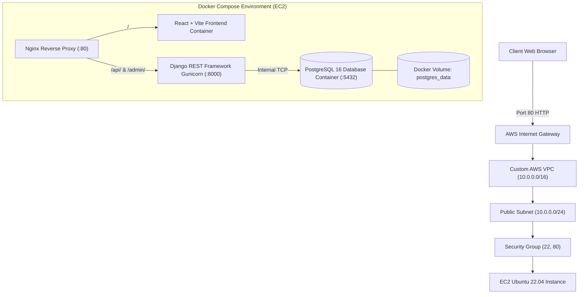

# Containerized Deployment of a Full Stack Application on AWS Using Terraform and Ansible

A production-grade, containerized full-stack Kanban board application deployed to AWS using **Terraform** for Infrastructure as Code (IaC), **Ansible** for automated server configuration, and **Docker Compose** with Nginx reverse proxy for container orchestration.

---

## 🏗️ Architecture Diagram



---

## 📦 Tech Stack & DevOps Toolchain

| Layer | Technologies Used |
| :--- | :--- |
| **Frontend** | React 18, TypeScript, Vite, Tailwind CSS, Zustand, @dnd-kit |
| **Backend** | Python 3.12, Django 6.x, Django REST Framework, Gunicorn, SimpleJWT |
| **Database** | PostgreSQL 16 (persisted via Docker Named Volume) |
| **Reverse Proxy** | Nginx (Alpine) handling port 80 routing, static caching, gzip |
| **Containerization** | Docker, Multi-Stage Builds, Docker Compose |
| **Kubernetes (K8s)** | Manifests, StatefulSet, Deployments, Ingress, HPA, Kustomize |
| **Infrastructure as Code** | Terraform (AWS VPC, Subnet, IGW, Route Tables, Security Group, EC2) |
| **Configuration Management**| Ansible (Automated Docker installation, git clone, env setup, stack run) |
| **CI/CD** | GitHub Actions (Lint, test, container validation, k8s validation, automated deploy) |

---

## 🚀 Quickstart: Local Deployment with Docker Compose

Run the entire full-stack application on your local machine with a single command:

```bash
# 1. Clone the repository
git clone https://github.com/riches17atom/Kanban-Thunder.git
cd Kanban-Thunder

# 2. Start all services (Database, Backend, Frontend, Nginx)
docker compose up -d --build

# 3. Check container status
docker compose ps
```

- **Web Application**: Visit [http://localhost](http://localhost)
- **Interactive Swagger Docs**: Visit [http://localhost/api/v1/docs](http://localhost/api/v1/docs)
- **Stop services**: `docker compose down`

---

## ☁️ Production Deployment on AWS

### Prerequisites
- [Terraform >= 1.5](https://developer.hashicorp.com/terraform/install)
- [Ansible >= 2.14](https://docs.ansible.com/ansible/latest/installation_guide/intro_installation.html)
- AWS Account configured via `aws configure`
- Local SSH Key Pair (`ssh-keygen -t rsa -b 4096 -f ~/.ssh/kanban_aws_key`)

---

### Step 1: Provision Infrastructure with Terraform

```bash
cd terraform

# Initialize provider plugins
terraform init

# Review execution plan
terraform plan

# Provision AWS resources (VPC, Subnet, Security Group, EC2)
terraform apply -auto-approve
```

Terraform will display the public IP and SSH command:
```text
Outputs:
instance_public_ip       = "13.233.54.120"
application_url          = "http://13.233.54.120"
api_documentation_url    = "http://13.233.54.120/api/v1/docs"
ansible_inventory_entry  = "kanban_server ansible_host=13.233.54.120 ansible_user=ubuntu ..."
```

---

### Step 2: Configure Server & Deploy with Ansible

```bash
cd ../ansible

# 1. Create inventory.ini using the IP output by Terraform
cp inventory.ini.example inventory.ini
# Edit inventory.ini and paste your EC2 public IP

# 2. Run the deployment playbook
ansible-playbook -i inventory.ini playbook.yml
```

**What Ansible Automates:**
1. Updates package cache and installs prerequisites.
2. Installs Docker Engine, containerd, and Docker Compose plugin.
3. Clones the project repository to `/home/ubuntu/app`.
4. Injects backend and frontend environment files.
5. Executes `docker compose up -d --build`.
6. Waits for healthy response on port 80.

---

### Step 3: Verify the Live Deployment

1. Open your browser and navigate to `http://<EC2_PUBLIC_IP>`.
2. Register a new user account or log in.
3. Create Kanban boards, add custom columns, and drag-and-drop tasks.
4. Verify Swagger API documentation at `http://<EC2_PUBLIC_IP>/api/v1/docs`.

---

### Step 4: Destroy Infrastructure to Avoid Costs

When testing or evaluation is complete, tear down all AWS resources:

```bash
cd terraform
terraform destroy -auto-approve
```

---

## ☸️ Kubernetes (K8s) Deployment Guide

For enterprise multi-node clusters (Minikube, K3s, Docker Desktop, or AWS EKS), production manifests are organized under [`k8s/`](./k8s):

### 1. Deploy the Entire Stack via Kustomize:
```bash
kubectl apply -k k8s/
```

### 2. Verify Workloads:
```bash
# Check namespace resources
kubectl get all -n kanban-thunder

# Check PVC storage binding
kubectl get pvc -n kanban-thunder
```

### 3. Horizontal Pod Autoscaling (HPA):
```bash
# View active autoscalers
kubectl get hpa -n kanban-thunder
```

### 4. Delete the Stack:
```bash
kubectl delete -k k8s/
```

---

## 📋 Deliverables Summary

- [x] **Architecture Diagram**: End-to-end traffic flow and container layout.
- [x] **Terraform Code** (`terraform/`): Modular AWS VPC, Subnet, IGW, Route Table, Security Group, and EC2.
- [x] **Ansible Automation** (`ansible/`): Idempotent playbook configuring Docker, environment variables, and stack startup.
- [x] **Docker Compose Configuration** (`docker-compose.yml`): Multi-container orchestration with PostgreSQL volume persistence.
- [x] **Kubernetes Suite** (`k8s/`): Production manifests with StatefulSet, Deployments, Ingress, HPA, and Kustomize.
- [x] **Nginx Reverse Proxy** (`nginx/nginx.conf`): Unified port 80 routing without CORS issues.
- [x] **CI/CD Pipeline** (`.github/workflows/deploy.yml`): Automated lint, build, Docker, K8s, and Terraform validation.
- [x] **Application Source Code**: Django REST Framework backend and React TypeScript frontend.

---

## 📄 License
This project is open-source under the MIT License.
